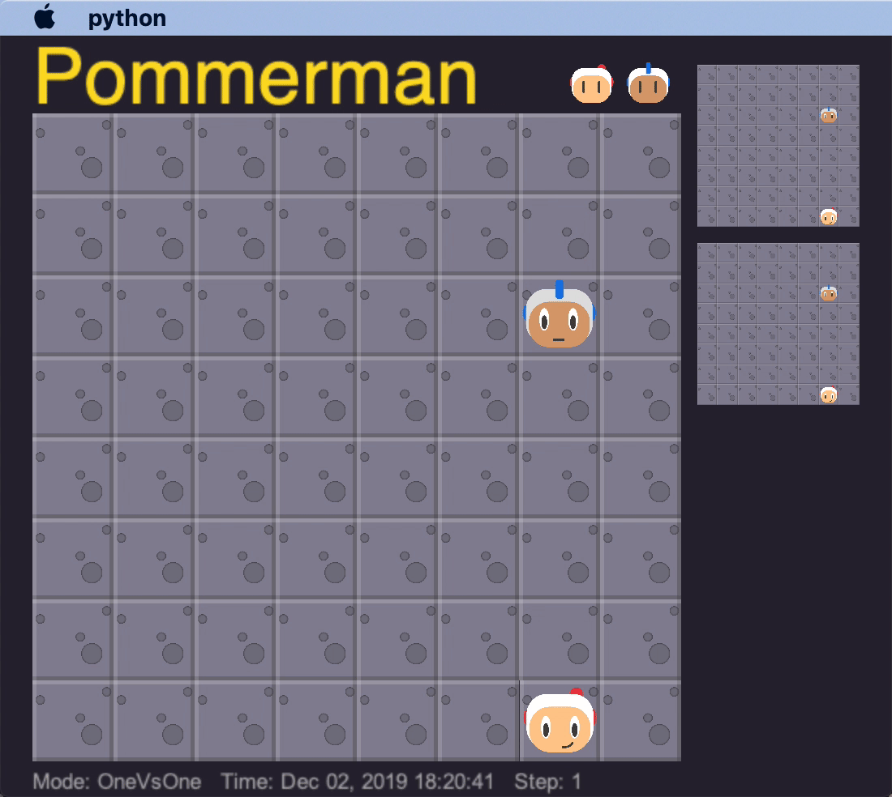

Reinforcement learning has been used to solve a number of challenging games recently. That said, there are many games that are as of yet unsolved or require a lot of domain knowledge in order to create intelligent agents. Pommerman, a bomberman clone ([further described here](/pom_info/)) provides a simple environment with fun and intuitive dynamics which are surprisingly deep.

# Problem Summary

How can we train agents capable of working and communicating together in a 2v2 competition? That is one of the core questions of the Pommerman competition this year (2019). Each agent must learn to not only manage aggressive strategies that can result in accidental suicide, it must also learn to predict and account for the actions of its teammate and enemies.

# Our Approach

We initially attempted to work from existing agents.

## Challenges

Poor code documentation, difficult parallelization, trouble learning complex strategies.

## Bugs and Issues

Skynet agents all got depressed and stopped placing bombs after their teammate died.

The built-in deterministic agent (SimpleAgent) has a few bugs in its AI that our agents learned to take advantage of in order to make it suicide.

## Improvements

Curricula

Network Architecture

# Results

Beat Skynet agent from last year!

# References

1. Resnick, Cinjon, et al. "Pommerman: A multi-agent playground." arXiv preprint arXiv:1809.07124 (2018).
1. Osogami, Takayuki, and Toshihiro Takahashi. "Real-time tree search with pessimistic scenarios." arXiv preprint arXiv:1902.10870 (2019).
1. Gao, Chao, et al. "Skynet: A Top Deep RL Agent in the Inaugural Pommerman Team Competition." arXiv preprint arXiv:1905.01360 (2019).
1. Malysheva, Aleksandra, Daniel Kudenko, and Aleksei Shpilman. "MAGNet: Multi-agent Graph Network for Deep Multi-agent Reinforcement Learning."
1. Peng, Peng, et al. "Continual match based training in Pommerman: Technical report." arXiv preprint arXiv:1812.07297 (2018).
1. Shah, Dhruv, Nihal Singh, and Chinmay Talegaonkar. "Multi-Agent Strategies for Pommerman."
1. Kartal, Bilal, et al. "Safer Deep RL with Shallow MCTS: A Case Study in Pommerman." arXiv preprint arXiv:1904.05759 (2019).
1. Resnick, Cinjon, et al. "Backplay:" Man muss immer umkehren"." arXiv preprint arXiv:1807.06919 (2018).
1. Kapoor, Sanyam. "Multi-agent reinforcement learning: A report on challenges and approaches." arXiv preprint arXiv:1807.09427 (2018).
1. Zhou, Hongwei, et al. "A hybrid search agent in pommerman." Proceedings of the 13th International Conference on the Foundations of Digital Games. ACM, 2018.
1. Gao, Chao, et al. "On hard exploration for reinforcement learning: A case study in pommerman." Proceedings of the AAAI Conference on 1. Artificial Intelligence and Interactive Digital Entertainment. Vol. 15. No. 1. 2019.
1. Perez-Liebana, Diego, et al. "Analysis of Statistical Forward Planning Methods in Pommerman." Proceedings of the AAAI Conference on 1. Artificial Intelligence and Interactive Digital Entertainment. Vol. 15. No. 1. 2019.
1. Kartal, Bilal, Pablo Hernandez-Leal, and Matthew E. Taylor. "Terminal Prediction as an Auxiliary Task for Deep Reinforcement Learning." Proceedings of the AAAI Conference on Artificial Intelligence and Interactive Digital Entertainment. Vol. 15. No. 1. 2019.
